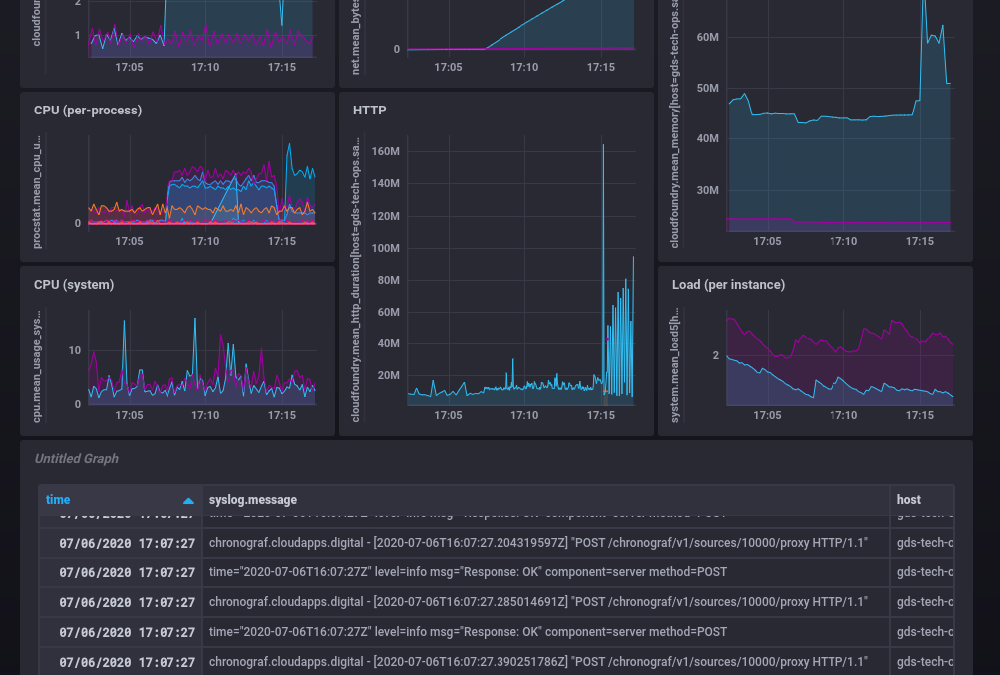

# paas-chronograf-buildpack

Cloudfoundry buildpack for deploying a [Chronograf][chronograf] instance
connected to an `influxdb` service instance.

* Visualise your application logs and metrics by adding [paas-telegraf-buildpack][] sidecars
* Alert on metric conditions by combining with [paas-kapacitor-buildpack][]



Designed for use with GOV.UK PaaS cloudfoundry, PRs welcome for other
cloudfoundry's with influxdb service support.

Chronograf does not provide any metrics itself, to get
your application logs and metrics ingested into your
InfluxDB instance, add the [paas-telegraf-buildpack][]
sidecar to each of your applications.

## Usage

Create a manifest.yml describing the chronograf deployment:

```yaml
---
applications:

- name: chronograf
  memory: 250M
  instances: 1
  stack: cflinuxfs3

  buildpacks:

    # optional: include telegraf sidecar to ingest metrics
    - https://github.com/chrisfarms/paas-telegraf-buildpack

    # optional: include kapacitor sidecar
    - https://github.com/chrisfarms/paas-kapacitor-buildpack

    # required: include this buildpack
    - https://github.com/chrisfarms/paas-chronograf-buildpack

  services:

    # required: bind an influxdb service to read from
    - my-influx-db-service-instance
```

Push your application:

```
cf push -f manifest.yml
```

Note: This buildpack does not require any other files, but if `cf` complains
you don't have any files during push, you may need to add _something_ to keep
it happy (for example: `touch Chronograf`).

[chronograf]: https://www.influxdata.com/time-series-platform/chronograf/
[paas-kapacitor-buildpack]: https://github.com/chrisfarms/paas-kapacitor-buildpack
[paas-telegraf-buildpack]: https://github.com/chrisfarms/paas-telegraf-buildpack
